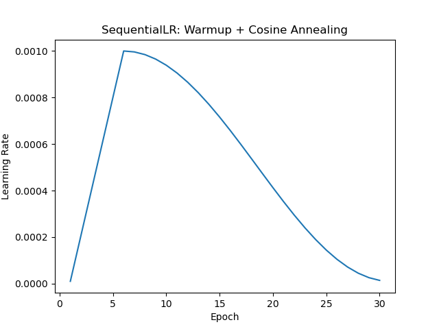
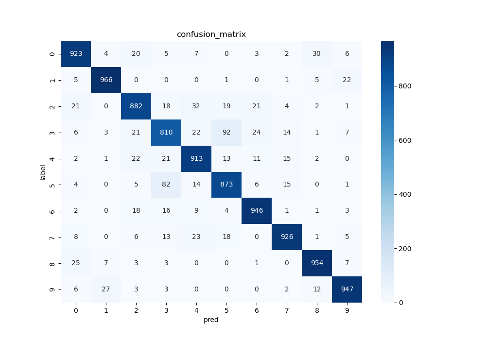
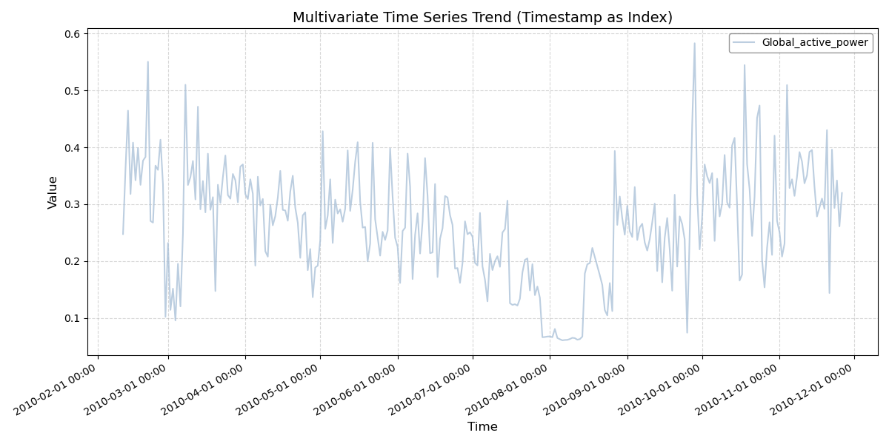
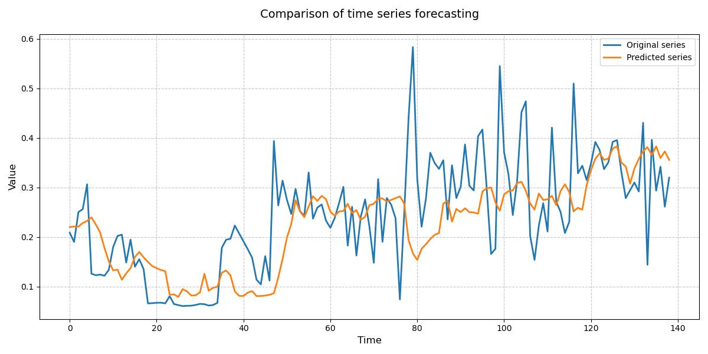
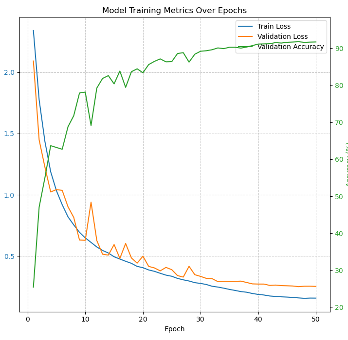

# DeepLearner————基于 Pytorch 的深度学习模型训练工具

为**黄绪艺**专门编写的 Pytorch 深度学习框架工具教程，有问题 *@神奇之星*【😜】

## 1. 项目结构

1. **模型**：./models【空，存放预训练模型与检查点】
   1. **模型检查点**：./models/checkpoints/
   2. **预训练模型**：./models/pretrained/
2. **数据**：./data【空，存放任务数据集】
3. **模型训练与评估框架（核心）**：./Learner
   1. **工具包**：./Learner/utils
   2. **自定义模型类**：./Learner/models
   3. **数据集构建类**：./Learner/datasets
   4. **模型训练类**：./Learner/trainers

## 2. 工具包

### 2.1 自定义学习率调度器

- Learner.utils.lr
   1. **线性预热+余弦退火调度器**：WarmUpCosineAnnealingLR
   2. **绘制学习率调度器变化曲线**：draw_lr



### 2.2 数据集划分

- Learner.utils.split
   1. **按照比例划分训练集、验证集（可选）、测试集（可选）**：split_three_ways

### 2.3 可视化

- Learner.utils.plot
  1. **训练损失**：draw_loss
  2. **混淆矩阵**：conf_matrix
  3. **多维时间序列曲线**：plot_ts
  4. **时间序列预测曲线**：plot_forecast_comparison







## 3. 模型

存放一些自定义的模型架构

- Learner.models：
   - Vgg
   - Conv1d+GRU

## 4. 数据集构建类

存放一些自定义的数据集构建类：
- Learner.datasets：
   - time_series_datasets：多维时间序列预测数据加载
   - textformer_datasets：Transformer Transformer 文本标签对加载

## 5. Trainer 类

定义于`trainer.py`中。

**功能：**

1. 初始化：__init__
   1. 定义模型训练所需工具
      1. 优化器
      2. 学习率调度器
      3. 梯度缩放器
      4. 损失函数
      5. . . .
   2. 定义模型训练所需超参数
      1. epochs
      2. batch_size
      3. learning_rate
      4. . . .
   3. 加载模型训练所需数据
      1. 训练集
      2. 发展集（可选，不改变使用方法）
   4. 自动检测 GPU
2. 模型训练接口：__fit__
   1. 管理模型检查点，包含：
      1. 模型参数
      2. 优化器状态
      3. 训练的轮数
      4. 训练集损失
      5. 发展集损失（没有发展集则没有）
      6. 发展及准确率（没有发展集则没有）
   2. 模型训练方法
      1. **可分段训练**，只需指明加载模型的编号即可
         1. 检查点命名规则：`checkpoint_*.pth`，其中`*`为加载的模型的训练总轮数
         2. 训练后按规则保存新检查点
      2. 通过**继承 Trainer 类**自定义模型训练与验证方法
   3. 训练数据图像绘制
      1. 训练集损失曲线
      2. 发展集损失曲线（没有发展集则没有）
      3. 发展集准确率曲线（没有发展集则没有）
7. 模型评估
8. 模型预测

**用法演示：**

1. 根据任务，定义**数据集构建方式**
2. 在外部定义好相应的工具（优化器、学习率调度器、数据集加载器 ...）
3. 继承 Trainer 类并根据任务**重写以下方法**
   1. __forward_pass__：前向传播与损失计算
   2. __dev__：模型验证与指标计算
   3. __eval__：模型评估方法
   4. __predict__：模型预测方法
4. **实例化**自定义的 Trainer 子类，传入相应的参数，调用 **fit** 方法即可进行流畅训练

```Python
# 定义模型参数
vocab_size = 21128  # 词汇表大小
hidden_size = 768  # 隐藏层大小
max_position_embeddings = 512  # 序列的最大长度
num_hidden_layers = 4  # Transformer 层的数量
num_attention_heads = 8  # 注意力头的数量
num_labels = len(tag_set)  # 标签数量
batch_size = 256  # 样本批量

# 初始化模型对象
model = EncoderModelWithCRF(
        vocab_size, 
        max_position_embeddings,
        num_hidden_layers, 
        hidden_size, 
        num_attention_heads, 
        num_labels
)

# 数据加载器
train_loader = DataLoader(train_dataset, batch_size=batch_size, shuffle=True)
dev_loader = DataLoader(dev_dataset, batch_size=batch_size, shuffle=False)  # 验证时不需要shuffle

# 优化器
optimizer = optim.AdamW(model.parameters(), lr=5e-5)
scaler = GradScaler()
# 学习率调度器：验证集上的性能指标停止提升时，减小学习率来帮助模型跳出局部最优，继续优化
scheduler = optim.lr_scheduler.ReduceLROnPlateau(
        optimizer,
        mode='min',
        factor=0.1,
        patience=5
)

# 训练器
trainer = Trainer(
    model=model,  # 模型
    train_dataloader=train_loader,  # 训练集加载器
    dev_dataloader=dev_loader,  # 验证集加载器
    scaler=scaler,  # 梯度缩放器
    optimizer=optimizer,  # 优化器：带动量的随机梯度下降 
    scheduler=scheduler,  # 学习率调度器：验证集上的性能指标停止提升时，减小学习率来帮助模型跳出局部最优，继续优化
    batch_size=batch_size,  # 样本批量
    model_path='./model/checkpoint/',  # 模型检查点保存路径
)

# 训练轮次 1~20
trainer.fit(
    epoch_num=20,  # 训练轮次数
    pretrain=0,  # 预训练模型编号（0 代表没有）
)
```

训练日志输出：

```text
无预训练模型，从零开始训练 . . .
模型训练: 100%|██████████| 924/924 [06:05<00:00,  2.52it/s]
模型验证: 100%|██████████| 121/121 [01:20<00:00,  1.51it/s]
第 1 轮训练结束，训练集 loss 为 0.12058644361987517，发展集 loss 为 0.08586227569790665，发展集准确率为 0.9193435468697769
模型训练: 100%|██████████| 924/924 [06:07<00:00,  2.52it/s]
模型验证: 100%|██████████| 121/121 [01:20<00:00,  1.49it/s]
第 2 轮训练结束，训练集 loss 为 0.07473805309293462，发展集 loss 为 0.0612432196397673，发展集准确率为 0.9353729537841071
模型训练: 100%|██████████| 924/924 [06:10<00:00,  2.49it/s]
模型验证: 100%|██████████| 121/121 [01:19<00:00,  1.52it/s]
第 3 轮训练结束，训练集 loss 为 0.056853939682342015，发展集 loss 为 0.04973207804382094，发展集准确率为 0.9435586561458625
模型训练: 100%|██████████| 924/924 [06:09<00:00,  2.50it/s]
模型验证: 100%|██████████| 121/121 [01:21<00:00,  1.49it/s]
第 4 轮训练结束，训练集 loss 为 0.046509532318390036，发展集 loss 为 0.04167734957800424，发展集准确率为 0.9509518591763468
模型训练: 100%|██████████| 924/924 [06:08<00:00,  2.50it/s]
模型验证: 100%|██████████| 121/121 [01:20<00:00,  1.51it/s]
第 5 轮训练结束，训练集 loss 为 0.0393467993914952，发展集 loss 为 0.035370468931688256，发展集准确率为 0.9575185987302188
模型训练: 100%|██████████| 924/924 [06:03<00:00,  2.54it/s]
模型验证: 100%|██████████| 121/121 [01:20<00:00,  1.50it/s]
第 6 轮训练结束，训练集 loss 为 0.034210996172144945，发展集 loss 为 0.032208996086019626，发展集准确率为 0.9595380661794355
模型训练: 100%|██████████| 924/924 [06:05<00:00,  2.53it/s]
模型验证: 100%|██████████| 121/121 [01:20<00:00,  1.50it/s]
第 7 轮训练结束，训练集 loss 为 0.030264556107566856，发展集 loss 为 0.02965508191653889，发展集准确率为 0.9618651365599195
模型训练: 100%|██████████| 924/924 [06:12<00:00,  2.48it/s]
模型验证: 100%|██████████| 121/121 [01:24<00:00,  1.44it/s]
第 8 轮训练结束，训练集 loss 为 0.027077135375954887，发展集 loss 为 0.02706876825079445，发展集准确率为 0.9652147648391693
模型训练: 100%|██████████| 924/924 [06:04<00:00,  2.54it/s]
模型验证: 100%|██████████| 121/121 [01:19<00:00,  1.52it/s]
第 9 轮训练结束，训练集 loss 为 0.024376021784798793，发展集 loss 为 0.024224317532556116，发展集准确率为 0.968644912393289
模型训练: 100%|██████████| 924/924 [06:14<00:00,  2.47it/s]
模型验证: 100%|██████████| 121/121 [01:19<00:00,  1.51it/s]
第 10 轮训练结束，训练集 loss 为 0.022091998341715054，发展集 loss 为 0.023229461144040193，发展集准确率为 0.9693565993945994
模型训练: 100%|██████████| 924/924 [06:08<00:00,  2.51it/s]
模型验证: 100%|██████████| 121/121 [01:20<00:00,  1.50it/s]
第 11 轮训练结束，训练集 loss 为 0.0200248502549671，发展集 loss 为 0.02200943138257962，发展集准确率为 0.9716178626499581
模型训练: 100%|██████████| 924/924 [06:07<00:00,  2.52it/s]
模型验证: 100%|██████████| 121/121 [01:22<00:00,  1.46it/s]
第 12 轮训练结束，训练集 loss 为 0.01830952251491286，发展集 loss 为 0.020410754706341128，发展集准确率为 0.9732816487557564
模型训练: 100%|██████████| 924/924 [05:57<00:00,  2.59it/s]
模型验证: 100%|██████████| 121/121 [01:19<00:00,  1.52it/s]
第 13 轮训练结束，训练集 loss 为 0.01684800097396299，发展集 loss 为 0.019135370831320848，发展集准确率为 0.9741806471055587
模型训练: 100%|██████████| 924/924 [06:09<00:00,  2.50it/s]
模型验证: 100%|██████████| 121/121 [01:21<00:00,  1.48it/s]
第 14 轮训练结束，训练集 loss 为 0.01547356611984536，发展集 loss 为 0.018562518700972693，发展集准确率为 0.9761097298628644
模型训练: 100%|██████████| 924/924 [06:20<00:00,  2.43it/s]
模型验证: 100%|██████████| 121/121 [01:20<00:00,  1.50it/s]
第 15 轮训练结束，训练集 loss 为 0.014298564851187266，发展集 loss 为 0.017546491662794646，发展集准确率为 0.9764337458952982
模型训练: 100%|██████████| 924/924 [06:09<00:00,  2.50it/s]
模型验证: 100%|██████████| 121/121 [01:26<00:00,  1.40it/s]
第 16 轮训练结束，训练集 loss 为 0.013228093235636557，发展集 loss 为 0.017887786892819994，发展集准确率为 0.9765128241109374
模型训练: 100%|██████████| 924/924 [06:12<00:00,  2.48it/s]
模型验证: 100%|██████████| 121/121 [01:20<00:00,  1.50it/s]
第 17 轮训练结束，训练集 loss 为 0.012332732361858284，发展集 loss 为 0.016420549915118283，发展集准确率为 0.9772483622474645
模型训练: 100%|██████████| 924/924 [06:19<00:00,  2.43it/s]
模型验证: 100%|██████████| 121/121 [01:19<00:00,  1.52it/s]
第 18 轮训练结束，训练集 loss 为 0.011479841177331614，发展集 loss 为 0.015806308951352006，发展集准确率为 0.9787765754393389
模型训练: 100%|██████████| 924/924 [06:08<00:00,  2.51it/s]
模型验证: 100%|██████████| 121/121 [01:19<00:00,  1.51it/s]
第 19 轮训练结束，训练集 loss 为 0.01072267169693235，发展集 loss 为 0.015527156093119344，发展集准确率为 0.9793853426840557
模型训练: 100%|██████████| 924/924 [06:13<00:00,  2.47it/s]
模型验证: 100%|██████████| 121/121 [01:24<00:00,  1.44it/s]
第 20 轮训练结束，训练集 loss 为 0.010025135430938754，发展集 loss 为 0.014879551564135458，发展集准确率为 0.9797082694681145
```

训练图像绘制：


